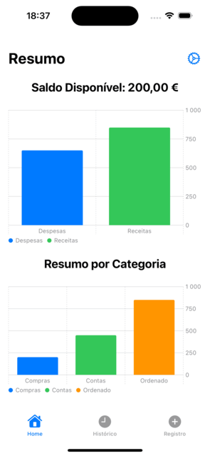
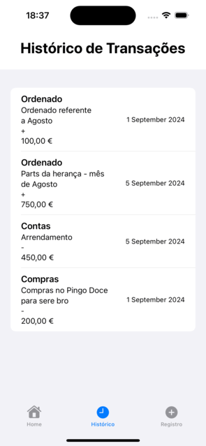
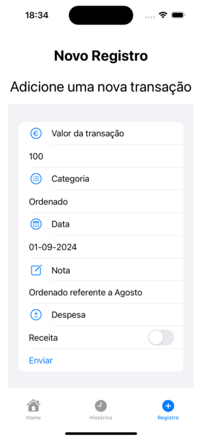

# GastosPessoais

**GastosPessoais** é um aplicativo desenvolvido em Swift com SwiftUI para a gestão de gastos pessoais. O aplicativo foi projetado com um design minimalista, utilizando ícones que representam o mundo real e proporcionando uma experiência de usuário fácil e rápida.

## Funcionalidades

- **Registro de Transações**: Adicione e categorize suas despesas e receitas.
- **Resumo Financeiro**: Visualize um resumo de despesas e receitas com gráficos intuitivos.
- **Histórico de Transações**: Consulte o histórico completo das transações registradas.
- **Configurações**: Limpe os registros da sessão atual para iniciar um novo período de controle financeiro.

## Capturas de Tela






## Instalação

Para rodar o projeto localmente, siga estas etapas:

1. **Clone o Repositório**

   ```bash
   git clone https://github.com/GiulianaFnch/GastosPessoais.git

## Instalação

Para rodar o projeto localmente, siga estas etapas:

2. **Abra o Projeto no Xcode**

   Navegue até o diretório do projeto e abra o arquivo `.xcodeproj`:

   ```bash
   cd GastosPessoais
   open GastosPessoais.xcodeproj

3. **Instale Dependências**

   Se você estiver usando CocoaPods ou Swift Package Manager, certifique-se de instalar as dependências. No Xcode, isso geralmente é feito automaticamente.

4. **Compile e Execute**
   
   Selecione o destino do simulador ou dispositivo e clique em "Run" no Xcode.

## Uso

1. **Adicionar Transações**

   Navegue para a tela de "Registro" e adicione transações especificando o valor, categoria, data e se é uma despesa ou receita.

2. **Visualizar Resumos**

   Na tela "Home", você verá gráficos mostrando um resumo das suas despesas e receitas, bem como um resumo por categoria.

3. **Consultar Histórico**

   Acesse a tela "Histórico" para visualizar todas as transações registradas.

4. **Configurações**

   Acesse as configurações para limpar os registros da sessão atual.

## Contribuição

Se você deseja contribuir para o projeto, siga estas etapas:

1. Faça um fork do repositório.
2. Crie uma branch para suas alterações (`git checkout -b minha-nova-feature`).
3. Faça commit das suas alterações (`git commit -am 'Adiciona nova feature'`).
4. Faça push para a branch (`git push origin minha-nova-feature`).
5. Envie um pull request.

## Contacto

Se você tiver dúvidas ou precisar de mais informações, entre em contacto comigo:

- **Email**: finochio44@gmail.com
- **LinkedIn**: [Giuliana Finochio](https://www.linkedin.com/in/giuliana-finochio-b8a42a225/)

---

Obrigado por usar o GastosPessoais! 🧾💰

